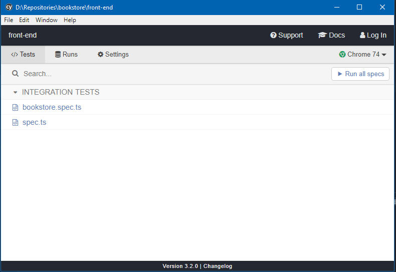

# Project Title

Cypress Integration Test

## Issues:

- Currently we got an issue about cypress & tsloader so that why the version of tsloader has been hard set to '5.4.5'. Reference here for more information [Here](https://github.com/TypeStrong/ts-loader/issues/929)

- Some PC will got an error when install npm packages, so in this case we need to use console/terminal with Administration permission in Windows or root in Mac (just in case got problems when install)

## Getting Started

These instructions will get you some knowledge about [Cypress](https://www.cypress.io/)

### Prerequisites

Make sure that your PC already run docker-compose up -d with no issue and you can access to Book Store, in your case:

```
http://localhost:8000
```

### Installing

Install node_modules, cypress will be downloaded together and the path is node_modules/cypress

```
npm i
```

or if you use yarn:

```
yarn
```

Then wait for the installation finish succesfully.

## Running the tests

Run test command:

```
npm run cy:open
```

or

```
yarn cy:open
```

Wait for cypress open their window:


Choose the spec you want to run test or run all specs button.

### Add more spec?

Add new spec ts file in folder cypress/integration

Note: If you want to add more command (in case you have some lines have been called multiple times), you could create you command in support/commands.js and define in support/index.d.ts
